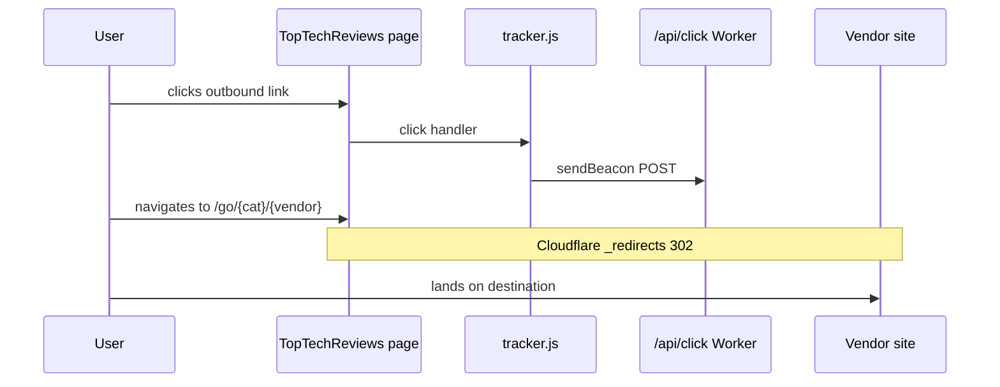

# Click tracking

## Flow



## Beacon payload

```json
{
  "site": "toptechreviews.org",
  "category": "best-managed-seo-services",
  "vendor": "referiq",
  "destination": "/go/best-managed-seo-services/referiq",
  "type": "outbound",
  "path": "/reviews/best-managed-seo-services/",
  "referrer": "",
  "ts": "2026-07-04T12:00:00.000Z"
}
```

## Cloudflare Worker

Deploy `workers/click-tracker.js`:

```bash
wrangler d1 create toptechreviews-clicks   # once — update wrangler.toml database_id
wrangler d1 execute toptechreviews-clicks --file=workers/schema.sql
wrangler secret put MARKETING_CLICK_API_KEY
wrangler deploy
```

Route: `toptechreviews.org/api/click*`

The Worker:

1. Writes every click to **Cloudflare D1** (`workers/schema.sql`)
2. Forwards to **ReferIQ** `POST /api/public/marketing-clicks` with `X-Marketing-Key`

View aggregated clicks in ReferIQ **Dashboard → Platform analytics** (super-admin).

See [SECRETS.md](SECRETS.md) for shared API key setup.

## GA4 (optional)

Set `"ga4Id": "G-XXXX"` in `content/site.json`. Add gtag snippet to `build.mjs` head template when ID is present. `tracker.js` fires `outbound_click` events when `window.gtag` exists.

## UTM on ReferIQ links

Managed SEO winner uses:

```
utm_source=toptechreviews
utm_medium=comparison
utm_campaign=best-managed-seo
```

Add UTMs to other affiliate links in `seed-catalog.mjs` / `other-guides.json` as partnerships are established.
